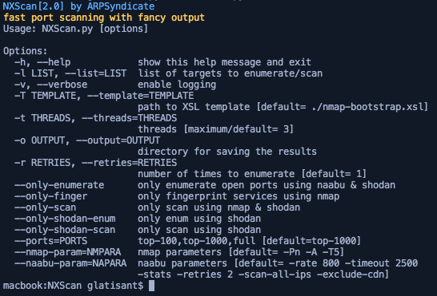

# NXScan | Fast port scanning with fancy output

## Screenshots

## Instructions for running
1. Make sure `nmap`, `naabu` & `xsltproc` are installed. 
2. Run `python3 NXScan.py`.  
3. `shodan` + `naabu` + `nmap` + `xsltproc` == `NXScan`

**COMPATIBILITY TESTED ON ARCHLINUX(x64) & DEBIAN(x64) ONLY** 
**FEEL FREE TO SUBMIT PULL REQUESTS**
